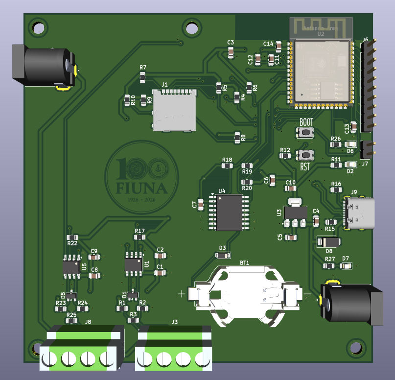
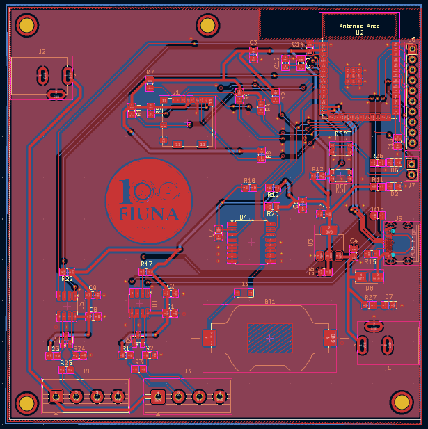

# Sistema de adquisición y visualización de datos de sensores de lluvia
### Estaciones meteorológicas distribuidas — Arroyo Mburicao

---

## Descripción

Sistema de monitoreo pluviométrico distribuido a lo largo del arroyo Mburicao. Cada estación integra un sensor óptico de lluvia con comunicación RS485, una PCB propia basada en ESP32-S3 con componentes SMD, y transmisión de datos vía DTU con respaldo local en MicroSD. Los datos se visualizan en tiempo real a través de un dashboard web.

---

## Imágenes del hardware

| Render 3D | PCB | Placa soldada |
|---|---|---|
|  |  |  |

## Características principales

- Microcontrolador ESP32-S3 con componentes de montaje superficial (SMD)
- Sensor óptico de lluvia con interfaz RS485 / Modbus RTU
- Transmisión de datos vía DTU (RS485 canal 2)
- Almacenamiento local en MicroSD (`datalog.csv`) con cola de reintentos (`temp.csv`)
- RTC DS3231M para sincronización de slots de medición cada 60 segundos
- Alimentación con reductor a 3.3V
- Caja para intemperie compatible con la estructura de la estación meteorológica
- Dashboard web en tiempo real

---

## Estructura del repositorio

```
arroyo-mburicao-estacion-lluvia/
│
├── hardware/
│   └── Estacion_lluviaV4/
│       ├── BOM/                           # Lista de materiales
│       ├── images/                        # Renders 3D y fotos del PCB
│       ├── planos/                        # Planos técnicos 2D con cotas
│       ├── step/                          # Modelos 3D STEP
│       ├── Estacion_lluviaV4.kicad_pcb    # PCB
│       ├── Estacion_lluviaV4.kicad_sch    # Esquemático principal
│       ├── conector_USB.kicad_sch         # Sub-esquemático USB
│       ├── DS3231.kicad_sch               # Sub-esquemático RTC
│       ├── esp32_modulo.kicad_sch         # Sub-esquemático ESP32-S3
│       ├── sd_to_esp32.kicad_sch          # Sub-esquemático MicroSD
│       ├── ttl_to_rs485.kicad_sch         # Sub-esquemático RS485
│       └── vcc_to_3v3.kicad_sch           # Sub-esquemático alimentación
│
├── software/
│   ├── esp32s3_lluvia/                    # Proyecto principal ESP-IDF
│   │   ├── main/                          # Loop principal y pipeline
│   │   ├── components/                    # Drivers por módulo
│   │   │   ├── config/                    # Configuración de pines
│   │   │   ├── rtc/                       # Driver DS3231M (I2C)
│   │   │   ├── sdcard/                    # MicroSD (SPI + FAT)
│   │   │   ├── modbus_rtu/                # Modbus RTU (RS485 canal 1)
│   │   │   ├── dtu/                       # DTU (RS485 canal 2)
│   │   │   └── rs485/                     # Driver RS485 genérico
│   │   ├── CMakeLists.txt
│   │   └── sdkconfig                      # Configuración del proyecto
│   │
│   └── tests/                             # Pruebas aisladas por componente
│       ├── test_led/                      # Prueba LED debug
│       ├── test_rtc/                      # Prueba DS3231M
│       ├── test_sdcard/                   # Prueba MicroSD
│       └── test_modbus/                   # Prueba sensor lluvia Modbus RTU
│
├── mechanical/
│   ├── caja_tapa/                         # Modelo de la caja para intemperie
│   ├── ensamblaje/                        # Ensamblaje completo
│   └── soporte_sensor/                    # Estructura soporte del sensor
│
├── dashboard/
│   └── README.md                          # Link al repositorio del dashboard
│
└── docs/
    ├── report/                            # Informes de proceso y final
    └── photos/                            # Fotos del prototipo
```
---

## Hardware

### Diagrama de bloques

```
Sensor de lluvia (RS485/Modbus RTU)
            │
            ▼
        ESP32-S3
            ├── RTC DS3231M  (I2C)
            ├── MicroSD      (SPI)
            ├── RS485 canal 1 → Sensor de lluvia
            └── RS485 canal 2 → DTU → Base de datos en la nube
```

### Versiones del PCB

| Versión | Fecha | Estado |
|---|---|---|
| v1.0 | — | Fabricación inicial |
| v2.0 | — | Fabricación inicial |
| v3.0 | — | Fabricación inicial |
| v4.0 | — | En desarrollo |

Los archivos de fabricación se encuentran en `hardware/Estacion_lluviaV4/planos/`.

---

## Software

El código fuente del ESP32-S3 está desarrollado en **ESP-IDF (CMake)** e incluye drivers para RS485, Modbus RTU, DTU, RTC DS3231M y MicroSD.

| Módulo | Descripción |
|---|---|
| `esp32s3_lluvia` | Pipeline completo de medición y transmisión |
| `tests/test_led` | Prueba de LED de debug |
| `tests/test_rtc` | Prueba del RTC DS3231M |
| `tests/test_sdcard` | Prueba de MicroSD |
| `tests/test_modbus` | Prueba del sensor de lluvia vía Modbus RTU |

Ver descripción completa del flujo de operación en [`software/esp32s3_lluvia/README.md`](software/esp32s3_lluvia/README.md).

---

## Dashboard

El dashboard de visualización en línea está desarrollado en Next.js y desplegado en Vercel.

- 🔗 Repositorio: [hydromet-dashboard](https://github.com/carolparedesf/hydromet-dashboard)
- 🌐 Demo en vivo: [hydromet-dashboard.vercel.app](https://hydromet-dashboard.vercel.app)

---

## Costos

Ver lista de materiales completa en [`hardware/Estacion_lluviaV4/BOM/BOM_Estacion_lluviaV4.xlsx`](hardware/Estacion_lluviaV4/BOM/BOM_Estacion_lluviaV4.xlsx).

---

## Resultados

Las mediciones, pruebas y gráficas obtenidas se encuentran en [`docs/preiminary_results/`](docs/results_preiminary/).

---

## Equipo

| Integrante | Contacto |
|---|---|
| Victoria Paredes | carolparedesf@fiuna.edu.py |
| Francisco Gonzalez | frgonzalez@fiuna.edu.py  |
| Melissa Olmedo |  meliolmedo@fiuna.edu.py |

**Institución:** Universidad Nacional de Asunción — Facultad de Ingeniería
**Cátedra:** Proyecto 3 y 4

---

## Licencia

- Hardware: [CERN-OHL-P v2](LICENSE)
- Firmware: MIT
- Dashboard: MIT
